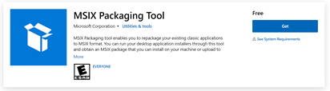

# DEMOs for MSIX intro session

This repository contains DEMO materials for MSIX intro session.

## Prerequisit

+ Install MSIX Packaging Tool from Store
  
+ Install self-signed certificate as "Trusted People"
  + Launch mmc.exe and add certificate snap-in as "Computer Account" 
  + Add self-signed certificate file as "Trusted People"
    + Right click "Trusted People"
    + Add Tasks -> Import *.pfx

## DEMO 1 -  Package the MSI to MSIX

This demo shows pckaging present msi to MSIX.

+ 