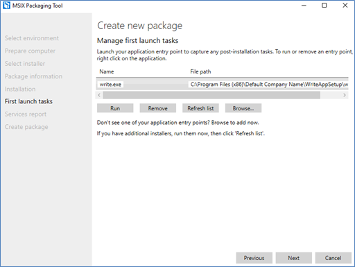

# DEMOs for MSIX intro session

This repository contains DEMO materials for MSIX intro session.

## Prerequisit

+ Install MSIX Packaging Tool from Store  
  
+ Install self-signed certificate as "Trusted People"
  + Launch mmc.exe and add certificate snap-in as "Computer Account" 
  + Add self-signed certificate file as "Trusted People"
    + Right click "Trusted People"
    + Add Tasks -> Import *.pfx

## DEMO 1 - Package the MSI to MSIX

This demo shows packaging present msi to MSIX.

+ Open the MSIX Packaging Tool and select “Application package”
+ Select “create package on this computer” and select “Next”.
+ Now the tool will check for the installed “MSIX Packaging Tool Driver” – this may take a few minutes to complete.
+ Disable Windows Search and SMS Host services by selecting the checkbox and then clicking the “Disable selected” button.  

+ Click the “Browse” button and find the WriteApp.msi from this module’s Assets folder.
+ From the Signing Preference drop-down select “Sign with a certificate (.pfx)”. Browse .pfx file and input password. Click Next.  

+ Change the Publisher display name to Contoso.
+ Package name and Display name should both be “WriteAppSetup”.  

+ Click Next
+ It should now install the application keeping track of the file and shortcut addition. It is a quick installation. Follow the installation wizard until it completes. Then click Next
+ Click to select the write.exe as your entry point. Click Run. This practice will help gather any first launch dependencies that may be downloaded.  

+ Close the write.exe application.
+ Click Next

+ Click Yes, move on.
+ If any Services exist they would be discovered at this point and show up.  

+ No Services were detected, click Next.  

+ Click Create.

## DEMO 2 - Explore the package in the Package Editor

This demo shows exploring the package continued by DEMO 1.

+ Click the Package editor button.
+ Select the Package files and drill into the package location, VFS (Virtual File System), ProgramFilesX86->Default Company Name-> WriteAppSetup  

+ Explore the Virtual Registry and Capabilities.
+ Note that you can both explore and Unpack any MSIX, as well as Sign using this tool.
+ Click Cancel

## DEMO 3 - MSIX from a Visual Studio Solution

+ Clone WpfApp from this repository.
+ Right click on the solution, click ADD / NEW PROJECT...
+ Search for `packaging` and add a **Windows Application Packaging Project**.
+ Choose the min and tested version (you can keep the default values).
+ Right click on the **Dependencies** node of the project in the Solution Explorer.
+ Choose the project to deploy in the list
+ Right click on the Windows Application Packaging Project in the Solution Explorer and **PUBLISH** / **CREATE APP PACKAGES...**
+ Select **Sideloading**
+ select the certificate (.pfx) 
+ The MSIX is created.

